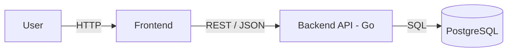

# Architecture

## Overview

Rentzy is a tool rental administration system for a small rental business.
It tracks tools, customers, reservations, rentals, and maintenance records.

The system is a **monorepo** with two independent applications:

- **backend** — Go REST API
- **frontend** — Vue


---

## High-Level Diagram


---
## Backend Architecture

```
┌──────────────────────────────────────────┐
│  HTTP Layer (internal/http)              │
│  - router.go                             │
│  - handler/*.go                          │
│  - respond/*.go                          │
│  Responsibility: HTTP concerns only      │
│  (JSON decode/encode, status codes)      │
└──────────────────┬───────────────────────┘
                   │
┌──────────────────▼───────────────────────┐
│  Service Layer (internal/service)        │
│  - tool.go, customer.go,                 │
│    reservation.go, rental.go, ...        │
│  Responsibility: business logic + SQL    │
│  (validation, transactions, calculations)│
└──────────────────┬───────────────────────┘
                   │
┌──────────────────▼───────────────────────┐
│  Domain Layer (internal/domain)          │
│  - tool.go, customer.go, reservation.go, │
│    rental.go, maintenance.go, errors.go  │
│  Responsibility: entities, enums,        │
│  sentinel errors. No dependencies.       │
└──────────────────────────────────────────┘
                   │
                   ▼
              PostgreSQL
```
