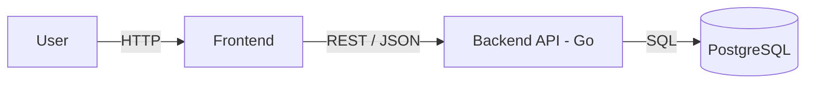

# Architecture

## Overview

Rentzy is a tool rental administration system for a small rental business.
It tracks tools, customers, reservations, rentals, and maintenance records.

The system is a **monorepo** with two independent applications:

- **backend** — Go REST API
- **frontend** — Vue

---

## High-Level Diagram

---
## Authentication and authorization

- **Authentication** — JWT (HS256). Users log in with username + password;
  passwords are hashed with bcrypt. A signed JWT is returned and must be
  sent as `Authorization: Bearer <token>` on protected endpoints.
- **Authorization** — role-based (RBAC). Three roles: `ADMIN`, `STAFF` and `CUSTOMER`.
  The JWT contains the role, middleware enforces access per route group.
